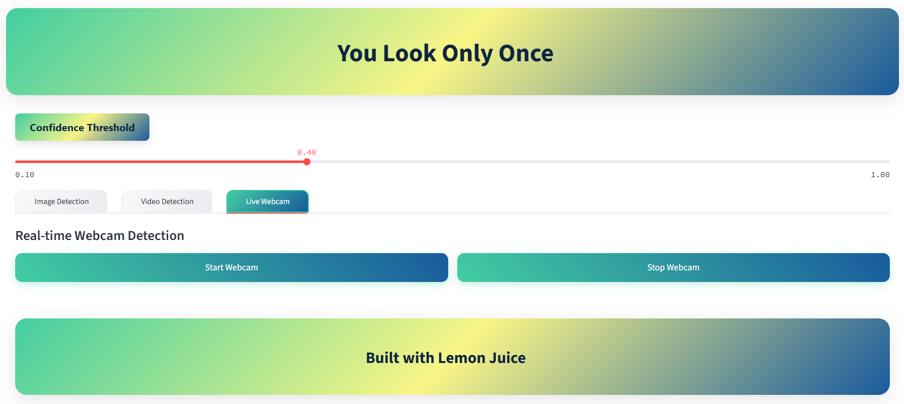

# Real-Time Object Detection with YOLOv8 
# (Webcam, Image & Video)


This is a object detection app powered by **YOLOv8** and built using **Streamlit**.
This project lets you detect objects in:

* Live webcam feed
* Uploaded images
* Uploaded videos

---

## User Interface



---

### 1. Clone the Repository

```bash
git clone https://github.com/suganthangnanavelan/Yolo-Object-Detection.git
cd Yolo-Object-Detection
```

### 2. Setup a Virtual Environment

```bash
python -m venv venv
venv\Scripts\activate
```

### 3. Install Dependencies

```bash
pip install -r requirements.txt
```

---

## Finally Run the App

```bash
streamlit run app.py
```

## Highlighting Features

* Streamlit-powered interactive UI with a clean look and feel.
* Three modes: Webcam, Image, and Video detection.
* Real-time object detection.
* Drag-and-drop image or video uploads.
* Confidence threshold slider to filter predictions.
* Easy to use **(Runs Locally)**
